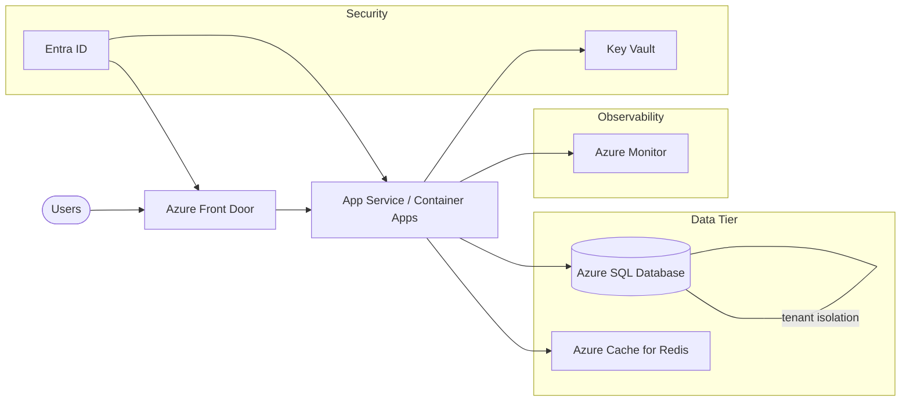
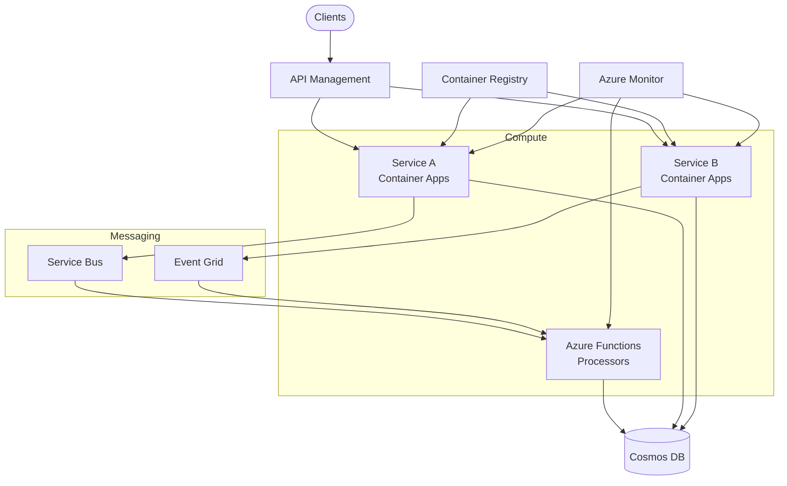
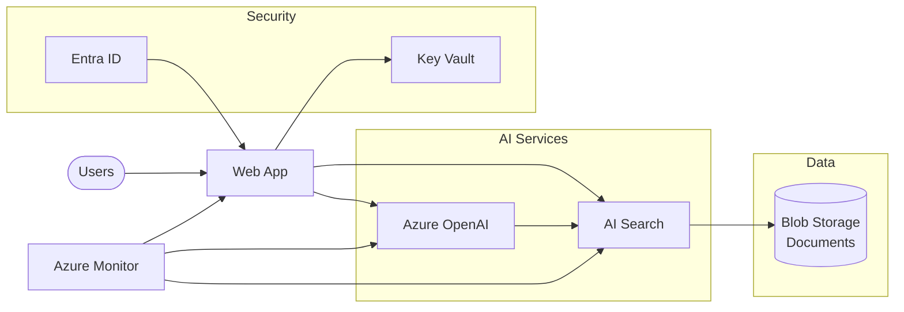

# Reference Architectures

These reference architectures provide proven starting points for common digital-native application patterns on Azure. Each includes a Mermaid diagram showing the key components and their relationships.

---

## SaaS Multi-Tenant Application

A multi-tenant SaaS architecture serves multiple customers from a shared infrastructure while maintaining data isolation and consistent performance. This pattern is the backbone of most B2B software companies on Azure, balancing cost efficiency (shared resources) with tenant security (data isolation).

**Key Design Decisions:**
- **Tenant isolation model** — Choose between database-per-tenant (strongest isolation, higher cost), schema-per-tenant (moderate isolation), or row-level security with shared tables (lowest cost, requires careful implementation). Start with row-level security and graduate tenants as needed.
- **Azure Front Door** — Provides global load balancing, WAF protection, and custom domain management per tenant. Use rules engine for tenant-based routing.
- **Caching strategy** — Use Azure Cache for Redis for session state, tenant configuration caching, and query result caching. Use separate Redis databases or key prefixes per tenant to prevent data leakage.
- **Authentication** — Entra ID supports multi-tenant app registrations, allowing customers to sign in with their own identity provider. Implement tenant resolution early in the request pipeline.
- **Scaling** — App Service plans or Container Apps scale based on aggregate load across tenants. Implement per-tenant rate limiting to prevent noisy-neighbor issues.

📐 [Azure Architecture Center: Architect multitenant solutions on Azure](https://learn.microsoft.com/azure/architecture/guide/multitenant/overview)

---

## Event-Driven Microservices

Event-driven microservices decouple services through asynchronous messaging, enabling independent scaling, deployment, and failure isolation. This pattern is ideal for systems where different components operate at different speeds or where you need to process high volumes of events reliably.

**Key Design Decisions:**
- **Service Bus vs Event Grid** — Use Service Bus for command-style messages requiring guaranteed ordered delivery and processing (e.g., order processing, payment workflows). Use Event Grid for event notifications where multiple subscribers react to state changes (e.g., blob uploaded, resource provisioned). Many systems use both.
- **Container Apps vs AKS** — Container Apps with Dapr provides built-in pub/sub, service invocation, and state management with minimal infrastructure overhead. Graduate to AKS only if you need custom networking, service mesh, or Kubernetes-specific features.
- **Azure Functions for processors** — Ideal for event-driven processors that scale to zero. Use Service Bus triggers for queue-based processing and Event Grid triggers for reactive workflows. Be aware of cold start latency on Consumption plan.
- **Cosmos DB** — Well-suited for microservices because each service can own its data with independent scaling. Design partition keys around service access patterns, not organizational structures.
- **API Management** — Provides a unified entry point with rate limiting, authentication, and API versioning. Use the Consumption tier for cost-effective starting point, upgrade to Standard v2 as traffic grows.

📐 [Azure Architecture Center: Event-driven architecture](https://learn.microsoft.com/azure/architecture/guide/architecture-styles/event-driven)

---

## AI-Powered Application (RAG Pattern)

Retrieval-Augmented Generation (RAG) grounds large language model responses in your organization's data, reducing hallucinations and providing answers based on authoritative sources. This pattern is the foundation of enterprise AI assistants, knowledge bases, and document Q&A systems.

**Key Design Decisions:**
- **Chunking strategy** — How you split documents into chunks for indexing directly impacts answer quality. Start with fixed-size chunks (512–1024 tokens) with overlap (10–15%), then iterate with semantic chunking based on your content structure. Test with real user queries early.
- **Vector search vs hybrid search** — Pure vector search works well for semantic similarity but can miss exact keyword matches. Hybrid search (vector + keyword with semantic reranking) consistently produces better results for enterprise content. Use AI Search's built-in hybrid and semantic ranking.
- **Azure OpenAI model selection** — Use GPT-4o for complex reasoning and synthesis tasks. Use GPT-4o mini for simpler queries, summarization, and cost-sensitive workloads. Deploy models in the same region as your AI Search index to minimize latency.
- **Index update pipeline** — Build an indexing pipeline (Azure Functions or AI Search indexers) that detects new/changed documents in Blob Storage and updates the search index. Design for incremental updates, not full re-indexing.
- **Security and access control** — Use Entra ID managed identities for all service-to-service authentication (no API keys in code). Implement document-level security filters in AI Search so users only retrieve content they're authorized to see.
- **Responsible AI** — Enable Azure OpenAI content filters, log all prompts and completions via Azure Monitor for audit trails, and implement input validation to prevent prompt injection attacks.

📐 [Azure Architecture Center: RAG with Azure OpenAI and AI Search](https://learn.microsoft.com/azure/architecture/ai-ml/architecture/baseline-openai-e2e-chat)
